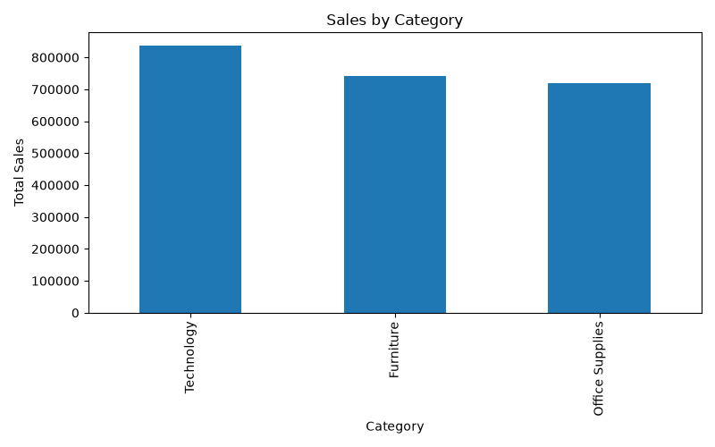
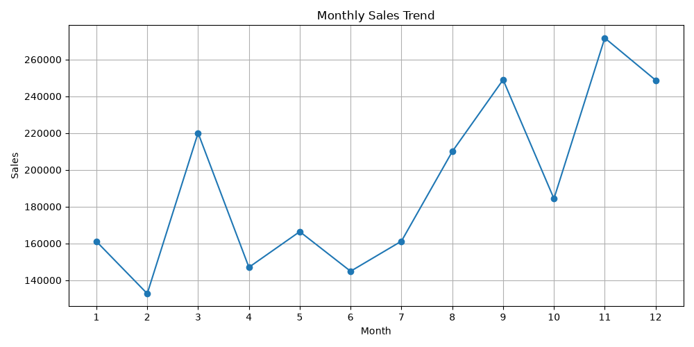
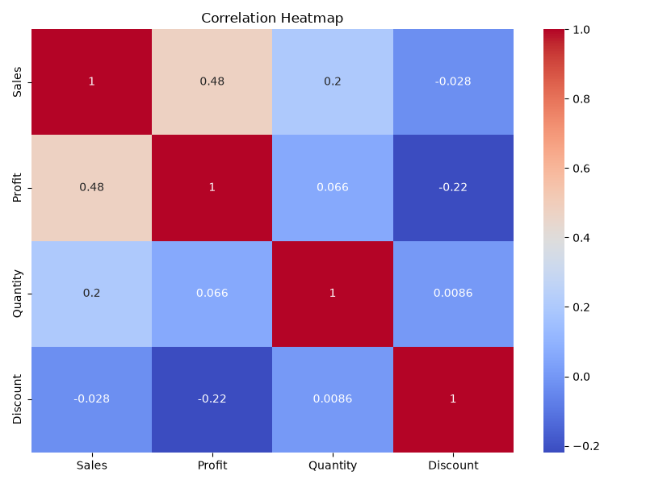

# 📊 Superstore Sales Analysis

## 📌 Overview

This project analyzes the Superstore Sales dataset using Python to uncover insights into sales performance, profitability, customer segments, and regional trends. It covers the complete data analysis workflow, from data cleaning and preprocessing to visualization and business insights.

## 📂 Dataset

- **Dataset:** Sample Superstore Dataset
- **Records:** ~9,994
- **Features:** 21

## 🛠 Tech Stack

- Python
- Pandas
- NumPy
- Matplotlib
- Seaborn
- Jupyter Notebook
- VS Code
- Git & GitHub

## 📈 Analysis Performed

- Data Cleaning & Preprocessing
- Exploratory Data Analysis (EDA)
- Feature Engineering
- Data Visualization
- Business Insights

## 📊 Dashboard Preview

### Sales by Category

### Monthly Sales Trend

### Correlation Heatmap

## 💡 Key Insights

- Technology recorded the highest sales.
- Consumer segment generated the most revenue.
- Higher discounts often reduced profitability.
- Sales performance varied across regions and months.

## 🚀 Future Improvements

- Develop an interactive Power BI dashboard.
- Build a Streamlit web application.
- Apply machine learning for sales forecasting.

## 👩‍💻 Author

**Ennam Vineela**  
B.Tech – Computer Science Engineering  
Aspiring Data Analyst